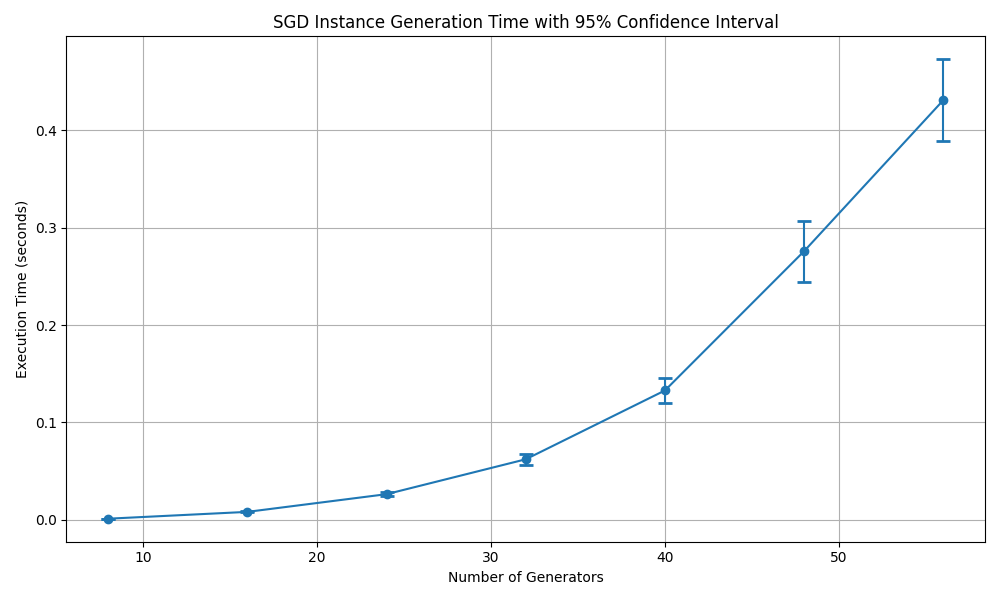
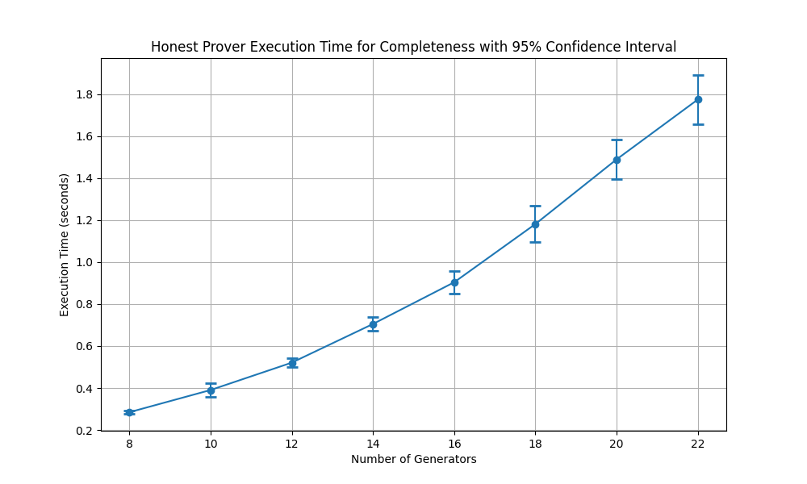
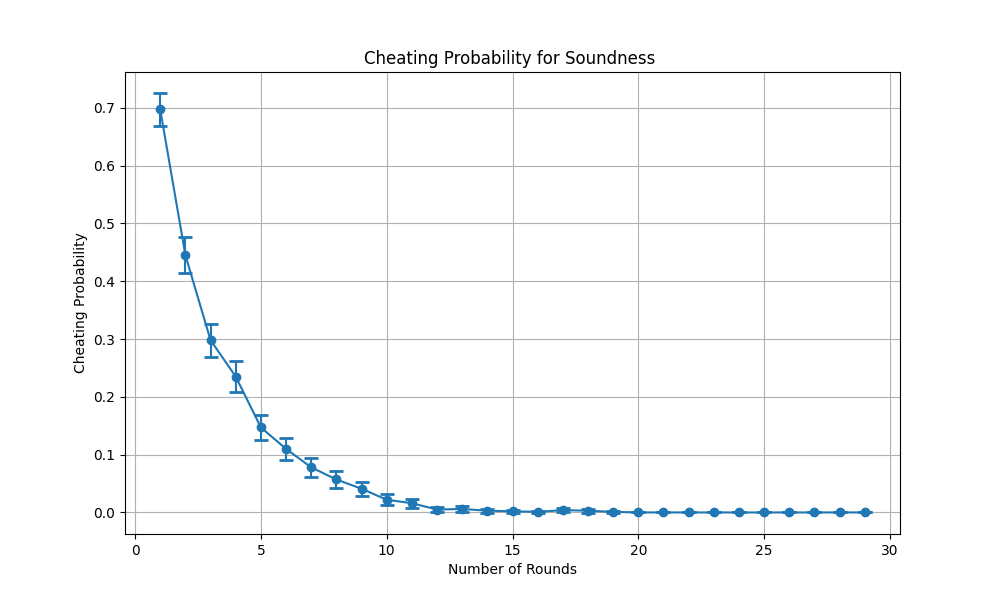
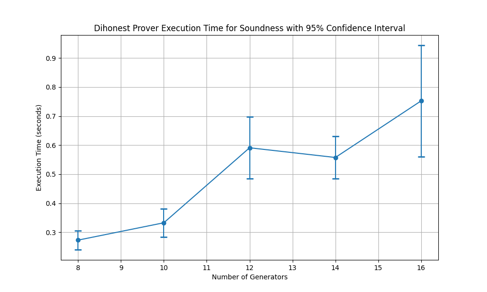

====================
Performance Analysis
====================

Setup Related Tasks
===================

In this section, we present the performance evaluation results for NP problem instance generation. The subgroup distance problem (SGD) 
relies on Max2SAT instances. We firstly create a Max2SAT instance using Motoki's algorithm. Then we convert the Max2SAT instance to SGD instance
using our novel approach.

Max2SAT Instance Generation
~~~~~~~~~~~~~~~~~~~~~~~~~~~~

For Max2SAT instance generation we use Motoki's approach: Mitsuo Motoki , "Test Instance Generation for MAX 2SAT with Fixed Optimal Value", Japan Advanced Institute of Science and Technology, School of Information Science

The paper proposes a randomized algorithm to generate test instances for the MAX 2SAT problem. The algorithm ensures that the generated instances have exactly one unsatisfied clause at the optimal solution, with a probability of 1. The author proves that the number of clauses in the generated instances is, with high probability, greater than the number of variables, aligning with known thresholds for unsatisfiability in random 2CNF formulas.

MAX 2SAT is a well-known NP-complete combinatorial optimization problem, where the goal is to find a truth assignment that maximizes the number of satisfied clauses in a 2CNF formula. To evaluate the performance of approximation algorithms for MAX 2SAT, both theoretical analysis and empirical studies are used. However, empirical studies require test instances with known optimal solutions. The paper addresses the challenge of generating such instances randomly.

The proposed algorithm generates an instance by first selecting a truth assignment `t` as the optimal solution. It then adds one randomly chosen clause that is unsatisfied by `t` and continues to add clauses satisfied by `t` until the formula becomes unsatisfiable. The algorithm ensures that the generated instance has a fixed optimal value, specifically one unsatisfied clause.

The paper analyzes the number of clauses added until the algorithm halts. It demonstrates that the threshold for the number of clauses is the number of variables, meaning that the algorithm is likely to stop only when the number of clauses exceeds the number of variables. This result coincides with the threshold for unsatisfiability in 2CNF formulas. The paper also provides a detailed mathematical analysis, proving that the algorithm works with high probability.

The paper presents a significant contribution to the generation of test instances for MAX 2SAT, providing a useful tool for evaluating approximation algorithms. The approach is mathematically rigorous and ensures that the generated instances meet the desired criteria with high probability.

.. _fig-max2sat_benchmark_with_ci:

.. figure:: figures/max2sat_benchmark_with_ci.png
   :alt:  The execution times with 95% confidence for Max2SAT problem instance generation.

   The execution times with 95% confidence for Max2SAT problem instance generation.

:numref:`fig-max2sat_benchmark_with_ci` illustrates the execution time required to generate a `Max2SAT` instance as a function 
of the number of variables. The data points are plotted with error bars that represent the 95% confidence intervals, providing 
a visual indication of the variability in the measurements. As the number of variables increases, the execution time also 
increases. This is consistent with the expected behavior as more complex instances with larger numbers of variables require 
more computational resources to generate. The error bars show that the variability in execution time also increases with 
the number of variables, which is typical as the system may experience greater fluctuations in processing time due to 
the increased complexity of the problem instances. Overall, the figure effectively conveys the relationship between 
the number of variables in a `Max2SAT` instance and the time required to generate it, highlighting both the trend and 
the associated uncertainties.

Subgroup Distance Problem Generation
~~~~~~~~~~~~~~~~~~~~~~~~~~~~~~~~~~~~

:numref:`fig-sgd_benchmark_with_ci`  illustrates the execution time required to generate an instance of the Subgroup 
Distance (SGD) problem as a function of the number of generators. The plot includes error bars representing a 95% 
confidence interval, providing insight into the variability of the timing measurements. As the number of generators 
increases, the execution time rises significantly, showing a clear upward trend that appears to be nonlinear. This 
indicates that the complexity of generating an SGD instance grows rapidly with the number of generators. The increasing 
size of the confidence intervals for larger numbers of generators suggests that the variability in execution time 
also increases with the complexity of the problem. This could be due to factors such as increased computational 
demands and system resource allocation. Overall, the figure effectively conveys the relationship between the 
number of generators and the time required to generate an SGD instance, while also highlighting the increasing 
uncertainty in execution time as the problem size grows.

.. _fig-sgd_benchmark_with_ci:

   The execution times with 95% confidence for SGD problem instance generation.

Security Related Validation
===========================
A zero-knowledge protocol has to satisfy completeness, soundness and zero-knowledge properties. In this section, we 
present the completeness and soundness validations for SDZKP. Please refer to :cite:p:`onur2024zeroknowledgeproofknowledgesubgroup`
for the theoretic proof for zero-knowledge property. 

Completeness Validation
~~~~~~~~~~~~~~~~~~~~~~~~

The benchmark code for validating the completeness of the SDZKP is designed to abort in any run if 
any round producess a verification failure (returns False). The code runs until completion proving
that none of the rounds are False if the prover is honest and has the solution to the subgroup 
distance problem.

.. _fig-completeness_with_ci:

   The execution times with 95% confidence for completeness validation.

:numref:`fig-completeness_with_ci`  The figure depicts the execution time required for an honest prover to demonstrate completeness 
in a proof system, plotted against the number of generators. The plot shows a clear upward trend, 
indicating that as the number of generators increases, the execution time also increases significantly. 
The relationship between the number of generators and execution time appears to be approximately 
linear, as suggested by the straight-line pattern of the data points. The error bars, representing 
a 95% confidence interval, provide an indication of the variability in the measurements. 
The confidence intervals are relatively small, particularly for lower numbers of generators, 
suggesting consistent execution times in those cases. However, as the number of generators 
increases, the confidence intervals widen slightly, indicating a growing uncertainty or variability 
in execution time. This could be attributed to the increasing computational complexity as the 
problem scales. Overall, the figure effectively illustrates the impact of increasing the number 
of generators on the time required for an honest prover to demonstrate completeness, highlighting 
both the trend and the associated variability.

Soundness Validation
~~~~~~~~~~~~~~~~~~~~

In this scenario, the prover is dishonest, it knows the public parameters of the SGD problem.
The prover creates a random solution; that is, it selects a subset of generators that produces a subgroup
element randomly. That he tries to convince the verifier that it knows the solution. In any protocol run,
if the verifier returns a False (not verified) result in any round, then the protocol run is assumed to
fail, otherwise the protocol run is countes as verified. The benchmark code for validating the soundness of the 
SDZKP is designed to find the ratio of  verified (returned True) protocol runs to the total number of 
protocol runs that we refer to as the cheating probability since the prover is dishonest.  :numref:`fig-soundness_cheating_prob` 
shows the cheating probability for 1000 simulation runs where the number of generators is set to 8 in SGD problem. As expected,
when the total number of rounds is 1 in a protocol run, then the cheating probability is :math:`\frac{2}{3}`. As the number of 
rounds increases, the cheating probability decreases exponentially with probability :math:`(\frac{2}{3})^k` where k is the 
total number of rounds in a protocol run. This trend is clearly visible in :numref:`fig-soundness_cheating_prob` . Approximately,
after 16 rounds, the cheating probability becomes less then 0.001. 

.. _fig-soundness_cheating_prob:

   The cheating probability for soundness validation.

:numref:`fig-soundness_executiontime_with_ci` shows the execution times of the protocol run as the number of rounds in a run increases.
As expected, a larger number of rounds in a run requires a larger amount of time to accomplish the verification process.

.. _fig-soundness_executiontime_with_ci:

   The execution times with 95% confidence for soundness validation.

