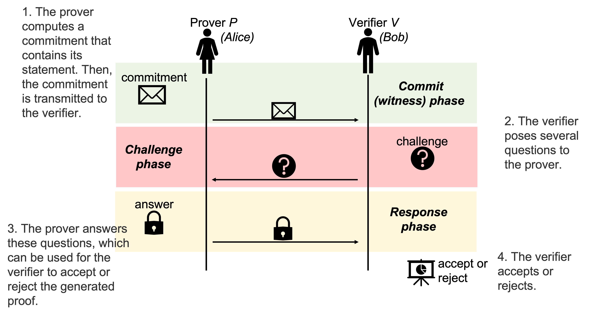

==================
SDZKP Requirements 
==================

In this section, we present the abstract model of zero-knowledge proof
(ZKP) schemes, the security requirements, design choices, performance
metrics, adversary model and threat analysis.

Abstract Model
==============

In a ZKP scheme, the statements (claims) are formally represented as a
relation :math:`R` between instances denoted as :math:`x` and witnesses
represented as :math:`w`. :math:`R` defines the acceptable :math:`(x,w)`
pairs; i.e., :math:`R` consists of the pairs :math:`(x,w)`. Then, the
language :math:`L` defines :math:`x` that have an associated
:math:`w \in R`; i.e.,
:math:`L=\{  x | \ (x,w)\in R \text{ for some } w   \}`. Here, :math:`L`
is the set of instances induced by :math:`R.` An instance is a commonly
known input in an interactive proof scheme and a witness is a private
information known by the prover. A membership claim can then be defined
in the form of :math:`x \in L` and a knowledge claim can be defined in
the statement form of “Considering :math:`R`, I know the witness
:math:`w` associated with the instance :math:`x`." In both types, the
statements can be represented as software pieces or Boolean/Arithmetic
circuits consisting of input nodes, output nodes and computation gates.
The literature considers mostly the depth of the circuit :math:`d`, or
circuit size :math:`C` (i.e., the number of gates in the circuit) or the
size of the input given to the circuit :math:`n=|x|` where
:math:`x \in L.`

A zero-knowledge proof facilitates proving that a statement is true
while preserving some secret (and privacy-sensitive) information. The
claims about privacy-sensitive data can be defined as statements. For
instance, the claim, ’I am older than 18 years old" is a **statement**
that is to be proven. An identity card (e.g., TCKK) is an **instance**
of this statement. The birth date and personal information of the person
signed by the government is the **witness** of this instance. A general
claim (statement) is substantiated by the instance. The association
between the instance and the secret information (or private information
such as the actual age in this example) is called the witness. Claim
(statement) and sometimes the instances are known to both of the
principals (parties taking part in a protocol).

Zero knowledge proof schemes are seen in two types. A proof to assure
that a statement is true or a proof of knowledge of an hidden
information. The principals in a ZKP scheme are the prover (Alice or
:math:`P`) and the verifier (Bob or :math:`V`) as shown in
:numref:`fig-zkparch` that depicts the overall architecture of a
ZKP scheme. In an abstract ZKP scheme as shown in
:numref:`fig-zkparch` , the prover generates a proof of the
statement and send it to the verifier. This step is called as the commit
(:math:`a`, witness) phase. Subsequently, the verifier challenges the
prover by posing some questions such as sending a binary sequence back
to the prover; this phase is called as the challenge (:math:`c`) phase.
The prover prepares adequate response to the challenge and send it to
the verifier (response, :math:`z` phase). Finally the verifier accepts
or rejects the claim without being able to reveal any confidential
information.

A :math:`\Sigma`-protocol shown in :numref:`fig-zkparch` is a
three move (commit :math:`a`, challenge :math:`c`, response :math:`z`)
special honest verifier zero knowledge proof protocol which has special
soundness :cite:p:`damgaard2002sigma`. Security requirements completeness,
soundness and zero-knowledge properties are given in :numref:`requirements:Security Requirements` with their variants. A :math:`\Sigma`-protocol
can be converted to a non-interactive mode by employing the Fiat-Shamir
transformation :cite:p:`fiat1986prove`. To employ this transformation, the
prover runs the first step and produces the commitment :math:`a`. Then,
instead of expecting a challenge from the verifier, the prover computes
a (random) challenge by using a random oracle that accepts :math:`a` and
the statement circuit (:math:`x`) as input. Using this challenge, the
prover produces the response in step 3.

.. _fig-zkparch:

   The general architecture of a ZKP protocol.

Let us give a mathematical example initially presented by Tompa and
Woll :cite:p:`tompa1987zero` :cite:p:`tompa1987random`. The set of integers between
:math:`1` and :math:`n` that are relatively prime with :math:`n` is
denoted by :math:`Z_n^*.` A number :math:`a \in  Z_n^*` is said to be a
quadratic residue mod :math:`n` if there exits :math:`x \in  Z_n^*` such
that :math:`a=x^2.` Say :math:`n=q_1q_2` for distinct primes :math:`q_1`
and :math:`q_2.` If the factorization of :math:`n` is not known, then
the problem whether :math:`a` is a quadratic residue modulo :math:`n` is
known to be computationally hard. Alice wants to prove that she knows an
element :math:`c \in  Z_n^*` such that :math:`a=c^2.` Then, the steps of
the ZKP scheme are:

Step 1 (commit phase): Alice (prover, :math:`P`) chooses a random
element :math:`k \in  Z_n^*` and computes :math:`K=k^2` mod :math:`n.`
She sends :math:`K` to Bob (verifier, :math:`V`).

Step 2 (challenge phase): Bob chooses :math:`b \in    \{0,1 \}` uniform
randomly and sends it to Alice.

Step 3 (response phase): Alice computes :math:`C=c^bk` and sends it to
Bob.

Step 4 (verification): Bob verifies :math:`C^2=a^bK` mod :math:`n.`

This protocol should be repeated sufficiently many times. If it is
applied only once, Alice can cheat Bob with probability at most
:math:`\frac{1}{2} .` If it is repeated :math:`m` times, then this
probability is reduced to :math:`\frac{1}{2^m} .`

.. _`sec:securityreq`:

Security Requirements
=====================

An interactive proof scheme (IP) is a two-party protocol between a
prover and a verifier (turing machines) where the prover (P) has infinite
computational power, while the verifier (V) operates within polynomial
time. IP should satisfy two conditions, namely completeness and soundness. 
Completeness property means that if the statement is true, the prover can convince the verifier. 
Soundness property means, if the statement is false, a dishonest prover cannot
mislead the verifier, except with negligable probability :cite:p:`goldwasser1989knowledge` . 
An essential feature of interactive proofs is the randomness employed by the verifier. 
If verifier sends each random choices (coin tosses) it has done, then IP is called 
public-coin (or Arthur-Merlin game as introduced by Babai    :cite:p:`babai1985trading`)  Some IP protocols may require an initial trusted setup phase,
potentially involving a trusted third party (TTP). 

A zero-knowledge proof (ZKP) is an IP where the verifier learns nothing
beyond the truth of the statement. If the prover convinces the verifier
with just one message, the proof is non-interactive. Non-interactive
ZKPs (NIZKP) can be achieved through a common reference string (CRS) or 
a random oracle model. A common approach to achive a NIZKP is to convert 
an interactive protocol into a non-interactive one using the Fiat–Shamir heuristic.
The zero-knowledge property is shown by using a probabilistic polynomial-time algorithm  
called simulator. It ensures that the verifier gains no additional information by giving  
outputs indistinguishable from the verifier’s without having a witness. The idea of the simulation paradigm :cite:p:`oded2001foundations` is 
“whatever a party can do by itself cannot be considered a gain from interaction with the outside."
Let us explain zero knowledge property more formally. 

An IP :math:`(P,V)` is considered to have zero knowledge property if for
every efficient (PPT) verifier :math:`V^*`, there exists an efficient
simulator :math:`S_{V^*}` such that for every true statement :math:`x,`
:math:`View_{V^*}[ P(x) \leftrightarrow V^*(x)]=S_{V^*}(x)` where :math:`View_{V^*}[ P(x) \leftrightarrow V(x)]` and :math:`S_{V^*}(x)` denote all messages
between :math:`P` and :math:`V^*` that appears in the real execution of the protocol
(which is called the view of :math:`V^*` on x) and output of :math:`S_{V^*}` respectively.  
In the given scenario, the verifier might not adhere to the specified protocol and could 
attempt to cheat. If we limit the scenario to an honest verifier, the protocol is 
referred to as an **honest verifier zero-knowledge proof**.

In real life, the definition of zero knowledge proof schemes is often relaxed.
This relaxation can be done in soundness or zero knowledge condition. For both conditions
these relaxations give rise to three variants of the properties; 
namely, perfect, statistical and computational.

**Perfect soundness** is the original condition that a computationally unbounded cheating prover
:math:`P^*` can not convince :math:`V`.  
If this :math:`P^*` has negligible probability of cheating the verifier, the protocol is said to have 
**statistical soundness**. It is said to have **computational soundness** if the probability of success of 
cheating prover  :math:`P^*` is negligable whenever :math:`P^*` is probabilistic polynomial time. 
Zero-knowledge systems with computational soundness are also referred to as arguments, 
a term introduced by Brassard, Chaum, and Crepeau :cite:p:`brassard1988minimum`.

Relaxation in zero knowledge property is done by allowing the simulator 
to sometimes fail. If we keep the original condition that the outputs of the actual protocol and the simulator are 
indistinguishable (i.e., absolutely no information is leaked) then we say 
the protocol has **perfect zero knowledge**  property. **statistical (a.k.a., almost-perfect) zero knowledge** 
permits a negligible amount of information to leak, but this leakage is so minor 
that it remains insignificant,  no matter how much computational power the verifier 
possesses. Although the two distributions differ, their statistical distance is negligible.  
If protocol allows for some information leakage, but only to an extent that is negligible for 
a verifier with limited (probabilistic polynomial-time) computational resources, 
then it is called **computational zero knowledge **. 

Next we give a stronger property then soundness condition:

(Two) Special Soundness: A three round (commit, challenge, response) protocol
for a relation :math:`R` is said to have special soundness if there
exists an efficient extractor :math:`A` which computes a :math:`w`
satisfying :math:`(x,w)\in R` for any :math:`x` and any pair of
transcripts :math:`(a,c,z),(a,c',z')` with :math:`c\not=c'.`

This definition is generalized as k-Special Soundness (see :cite:p:`attema2021compressed`):
A three round  public-coin IP for relation :math:`R` with challenge space consisting of :math:`N` elements 
is said to be :math:`k`-Special Sound (out of :math:`N`) if there exists a PPT algorithm such that on input 
a statement :math:`x` and :math:`k`-many accepting transcripts :math:`(a,c_1,z_1), \dots, (a,c_k,z_k)`` for the same commitment
with different challanges, it outputs a witness :math:`w`` satisfying :math:`(x,w) \in R.`

It is known that a :math:`k`-Special Sound IP with challenge space with :math:`N` elements has 
knowledge soundness with knowledge error :math:`\frac{k-1}{N}.'  :cite:p:`attema2021compressed'

Special honest verifier zero knowledge property: A three round (commit,
challenge, response) protocol for a relation :math:`R` is said to have
special honest verifier zero knowledge property if there exists an
efficient simulator :math:`S` which outputs an accepting transcript
:math:`(a,c,z)` with distribution just like the real transcript for any
given any :math:`x` and :math:`c.`

All in all, the ZKP implementations can be compared based on the
following design choices  :cite:p:`zkproof2022`:

1. Types of supported statements: a ZKP of knowledge or a ZKP of
   membership.

2. Whether or not a trusted setup is required: When existing ZKP
   protocols are analyzed, the following possibilities for the trusted
   setup phase emerge:

   1. No setup: In this case, the ZKP scheme does not require any
      trusted setup phase; e.g., a copy of the security parameter is the
      only information required for initializing the ZKP scheme. For
      instance, bulletproof does not require any setup phase.

   2. Uniform random string (public coin): If the messages produced by
      the verifier are uniform random strings, and if those messages are
      independent of the prover’s messages, then we say that the setup
      phase employs public coins. All parties have access to an output
      of a uniform random number generator.

   3. Common reference string (CRS): When the setup phase employs a
      publicly known information called as CRS known to everybody. This
      is the generalization of the public coins. In CRS, the information
      does not have to be uniform random.

   4. Designated verifier setup: When the CSR is known only to a
      designated verifier, the setup phase is called as designated
      verifier setup. In this approach, the setup algorithm executed by
      the prover is correlated with the setup algorithm executed by the
      verifier; and this requires a trust to the setup phase.

   5. Random oracle model: The setup phase defines a common
      cryptographically secure hash function that acts as a random
      oracle to produce nonces (numbers used once and never repeated)
      that are never used in the past invocations of the algorithm.

3. Interactive or not.

4. Assumptions about the underlying intractable problem: Most of the
   works in the literature using group theoretic approach allocates DLP.

Metrics for Comparing ZKP Schemes
=================================

The efficiency of ZKP implementations can be compared based on the
following performance metrics  :cite:p:`zkproof2022`. Here, we list the
most-commonly used metrics.

1. Proof size (succinctness): the size of the proof in comparison to the
   circuit size (:math:`C`) representing the statement.

   1. Fully succinct: :math:`\mathcal{O}(1)`

   2. Polylog succinct: e.g., :math:`\mathcal{O}(\log^2 C)`

   3. Sqare root succinct: :math:`\mathcal{O}(\sqrt{C})`

   4. Depth-succinct: e.g., :math:`\mathcal{O}(d \log C)` assuming that
      the depth of the verification circuit is :math:`d.`

   5. Non-succinct: the proof is not sublinear in :math:`C`.

2. The time complexity for the trusted setup (if exists)

3. The time complexity of the tasks executed by the prover :math:`P:`
   efficiency of the proof generation

4. The time complexity of the tasks executed by the verifier :math:`V`:
   efficiency of the proof verification

In addition to these metrics, round complexity, parallelizability,
batching, memory consumption, number of operations in the algorithms,
memory consumption, disk and storage requirements can be considered as
additional performance metrics for comparing various ZKP proposals
:cite:p:`zkproof2022`.

Zero-Knowledge Succinct Non-Interactive ARgument of Knowledge (zk-SNARK)
is a non-interactive ZKP protocol initially proposed by Bitansky et
al. in 2011. They showed that if there exist extractable
collision-resistant hash functions (ECRHs) and an appropriate private
information retrieval scheme, then there exist SNARKs for NP. Also in
this work, they propose candidates for ECRH constructions. One of these
is based on the hardness of discrete logarithm problem and the two
others are based on hard problems on lattices namely, knapsack
(subset-sum) problems. In 2016, Groth constructed an efficient zk-SNARK
for Quadratic Arithmetic Programs where he used bilinear groups. Zcash
uses Groth’s construction. A downside of zk-SNARK is it uses non-public
randomness in its setup phase. In other words, zk-SNARK requires a
trusted setup. Also, it is not quantum-safe. A remedy to these problem
is zk-STARK.

Scalable Transparent Zero-knowledge Argument of Knowledge (zk-STARK)
introduced by Ben-Sasson et al. in 2018. It is an Interactive Oracle
Proofs (IOP) system. zk-STARK is more transparent, i.e., it needs no
trusted set-up. zk-STARKS rely on collision-resistant hash functions.
The zk-STARK-friendly hash function  :cite:p:`ben2020stark` :cite:p:`canteaut2020report`
is the focus of extensive research campaign. Relying on hash functions,
it is quantum resistant. A major disadvantage of zk-STARKS is the proof
size compared to zk-SNARKS. There are some recent works that try to
reduce the proof length.

Zk-SNARK’s algorithmic complexity for prover
:math:`\mathcal{O}(C\log(C))` and verifier :math:`\mathcal{O}(1)` are
lower compared to zk-STARK’s complexity that is
:math:`\mathcal{O}(C \text{polylog}(C))` and
:math:`\mathcal{O}(\text{polylog}(C))`, respectively. The proof size of
zk-SNARK is :math:`\mathcal{O}(1)` whereas it is
:math:`\mathcal{O}(\text{polylog}(C))` for zk-STARK.

Aurora  :cite:p:`ben2019aurora` is a Zk-SNARK proposed by Ben-Sasson et al. in
2019. They developed the protocol for Rank-1 Constraint Satisfaction
(R1CS) which is an NP-complete language. Aurora employs a public
(transparent) setup phase. It is lightweight and quantum-safe. For the
same number of constraints defined in R1CS, they accomplished reducing
the proof size to 20 times shorter than the previous Zk-SNARK proposals.
Aurora uses an interactive oracle proof for solving univariate version
of the sumcheck problem  :cite:p:`lund1992algebraic`.

Hyrax  :cite:p:`wahby2018doubly` is another Zk-SNARK variant proposed by Wahby
et al. in 2017. They convert an interactive proof of arithmetic circuit
(AC) satisfiability to a ZKP scheme. Hyrax’s proofs are sublinear in
circuit size (succinct), does not require a trusted setup phase, secure
under the discrete log assumption.

Ligero is a zero knowledge argument based on a chosen
collision-resistant hash function. By making it non-interactive in the
random oracle model, an efficient zk-SNARKs can be obtained that do not
require a trusted setup or public-key encryption.

Bulletproof is a short zero-knowledge proof depending on the hardness of
discrete logarithm problem and has no trusted setup. It uses Pedersen
vector commitment and has very short the proof size by groundbreaking
method inner product algorithm. It can be non-interactive using
Fiat-Shamir heuristic. One disadvantage of Bulletproof is, it takes more
time to verify a bulletproof than to verify a SNARK proof.

Libra  :cite:p:`cryptoeprint:2019/317` is zero-knowledge proof scheme that has
both optimal prover time with a succinct proof size and
:math:`\mathcal{O}(d \log C)` verification time. Different from the
other proposals, Libra employs a one-time setup phase that does not have
to be repeated per statement. It relies on the GKR protocol
:cite:p:`goldwasser2015delegating`.

Adversary Model and Threat Analysis
===================================

An adversary is a (malicious) attacker carrying out an attack on the
protocol and an adversary model is the formal definition of the attacker
in a security protocol. Depending on the level of formalization, it may
be a set of statements about the capabilities (skill sets, advantages,
assumptions, and also limitations) of the attacker and its goal. An
adversary model can be an algorithm having some computation power.
Adversary models are generally used to prove the security of the
protocol. A widely used model is the Dolev-Yao model  
:cite:p:`dolev1983security`. In the Dolev–Yao model, the adversary can listen
to communication between the principals and can send data/messages to
principals. It may act as a man in the middle.

An adversary model usually defines

1. the assumptions about the attacker

   1. assumptions about the environment: whether the adversary is an
      insider or outsider. Connectivity of the adversary to the protocol
      infrastructure can also be evaluated here.

   2. intellectual resources: the intellectual resources of the
      adversary based on competence and knowledgeability.

   3. capabilities: the privileges of the adversary and whether or not
      it is active

   4. computational resources; e.g., number of CPUs, memory, etc.

   5. amount of accessible data

2. the goal(s) of the adversary.

While designing a zero knowledge protocol, the main security concerns
are whether or not completeness, soundness and zero knowledge properties
are satisfied. However, when zero-knowledge proofs are employed in
applications such as identification or authentication, additional
attacks can be implemented by an adversary. Below we briefly define the
attack vectors and the associated adversary models are presented in
:numref:`tab-attacks`  :cite:p:`major2020authentication` :cite:p:`walshe2019non`
:cite:p:`grassi2021poseidon` :cite:p:`pathak2021secure` :cite:p:`Dwork2004` :cite:p:`UMAR2021102374`.

1. Impersonation attacks (masquerading as prover)

2. Mutual impersonation: person-in-the-middle attack

3. Replay attacks

   1. General replay attacks (resending previously captured messages)

   2. Interleaving attack (a selective combination of information from
      previous protocol executions is used to attack the protocol)

   3. Reflection attack (some messages are replayed back to the sender)

   4. Delay attack (some messages are delayed by an active adversary)

4. Integrity attack (some messages are intelligently modified by an
   active adversary)

5. Brute force attack (all possible combinations to solve the
   intractable problem are tried)

6. Quantum attack (whether or not the protocol is quantum-safe?)

7. Redundancy information attack (a passive adversary listens to all
   messages on the channel and tries to derive useful information)

8. Timing attack (a passive adversary has access to system clocks and can measure how much time it takes for algorithms to run.) :cite:p:`Dwork2004`

.. _tab-attacks:

.. table:: Potential attacks and the adversary model.

      +-----------+-----------+----------+--------+-----------+-----------+
      | Attack    |  Goal(s)  | Location | **P/A**| Resources | **A       |
      |           |           |          |        |           | ccessible |
      |           |           |          |        |           | data**    |
      |           |           |          |        |           |           |
      +===========+===========+==========+========+===========+===========+
      | Im        | Break     | Insider  | Active | Bounded   | Some      |
      | personate | s         | outsider |        |           | :mat      |
      | as prover | oundness, |          |        |           | h:`(x,w)` |
      |           | cheat     |          |        |           | pairs     |
      |           | verifier  |          |        |           |           |
      +-----------+-----------+----------+--------+-----------+-----------+
      | Mutual    | Break     | Insider  | Active | Bounded   | Public    |
      | impe      | com       | outsider |        |           | data      |
      | rsonation | pleteness |          |        |           |           |
      | (person   | and       |          |        |           |           |
      | in the    | soundness |          |        |           |           |
      | middle)   |           |          |        |           |           |
      +-----------+-----------+----------+--------+-----------+-----------+
      | Replay    |           | Insider  | Active | Bounded   | Public    |
      | attacks   |           | outsider |        |           | data      |
      | (inte     |           |          |        |           |           |
      | rleaving, |           |          |        |           |           |
      | re        |           |          |        |           |           |
      | flection, |           |          |        |           |           |
      | delay)    |           |          |        |           |           |
      +-----------+-----------+----------+--------+-----------+-----------+
      | Integrity | Modify    | Insider  | Active | Bounded   | Public    |
      | attack    | messages  |          |        |           | data and  |
      |           | to break  |          |        |           | p         |
      |           | soundness |          |        |           | reviously |
      |           |           |          |        |           | captured  |
      |           |           |          |        |           | messages  |
      +-----------+-----------+----------+--------+-----------+-----------+
      | Brtute    | Break     | Outsider | P      | Bounded   | Public    |
      | force     | zero-     |          | assive | Unbounded | data      |
      | attack    | knowledge |          |        |           |           |
      +-----------+-----------+----------+--------+-----------+-----------+
      | Quantum   | Break     | Outsider | P      | Quantum   | Messages  |
      | attacks   | zero-     |          | assive | computer  | on        |
      |           | knowledge |          |        |           | channel   |
      +-----------+-----------+----------+--------+-----------+-----------+
      | R         | Break     | Outsider | P      | Unbounded | Messages  |
      | edundancy | zero-     |          | assive |           | on        |
      | in        | knowledge |          |        |           | channel   |
      | formation | by        |          |        |           |           |
      | attack    | eave      |          |        |           |           |
      |           | sdropping |          |        |           |           |
      |           | messages  |          |        |           |           |
      |           | or by     |          |        |           |           |
      |           | analyzing |          |        |           |           |
      |           | public    |          |        |           |           |
      |           | data      |          |        |           |           |
      +-----------+-----------+----------+--------+-----------+-----------+
      | Timing    | Reveal    | Insider  | P      | Bounded   | System    |
      | attacks   | secret    |          | assive |           | clocks    |
      |           | in        |          |        |           |           |
      |           | formation |          |        |           |           |
      +-----------+-----------+----------+--------+-----------+-----------+

Conclusion
==========

This report presents a comprehensive analysis of Zero-Knowledge Proof
(ZKP) schemes, focusing on their abstract models, security requirements,
design choices, and performance metrics. The study highlights the
fundamental principles of ZKP, distinguishing between proofs of
membership and proofs of knowledge. It also delves into the essential
security properties of completeness, soundness, and zero-knowledge,
outlining their formal definitions and practical implications.

Moreover, the report categorizes ZKP schemes based on their need for a
trusted setup, interaction patterns, and underlying cryptographic
assumptions. Notable ZKP implementations such as zk-SNARKs and zk-STARKs
are compared in terms of proof size, computational complexity, and
security features. The analysis extends to newer protocols like Aurora
and Bulletproof, discussing their unique advantages and limitations.

The adversary model and threat analysis section provides a detailed
account of potential attacks and the corresponding adversarial
capabilities, emphasizing the importance of robust security measures in
ZKP protocols. By understanding these aspects, researchers and
practitioners can make informed decisions about the most suitable ZKP
schemes for their specific applications, ensuring both efficiency and
security in cryptographic implementations.
